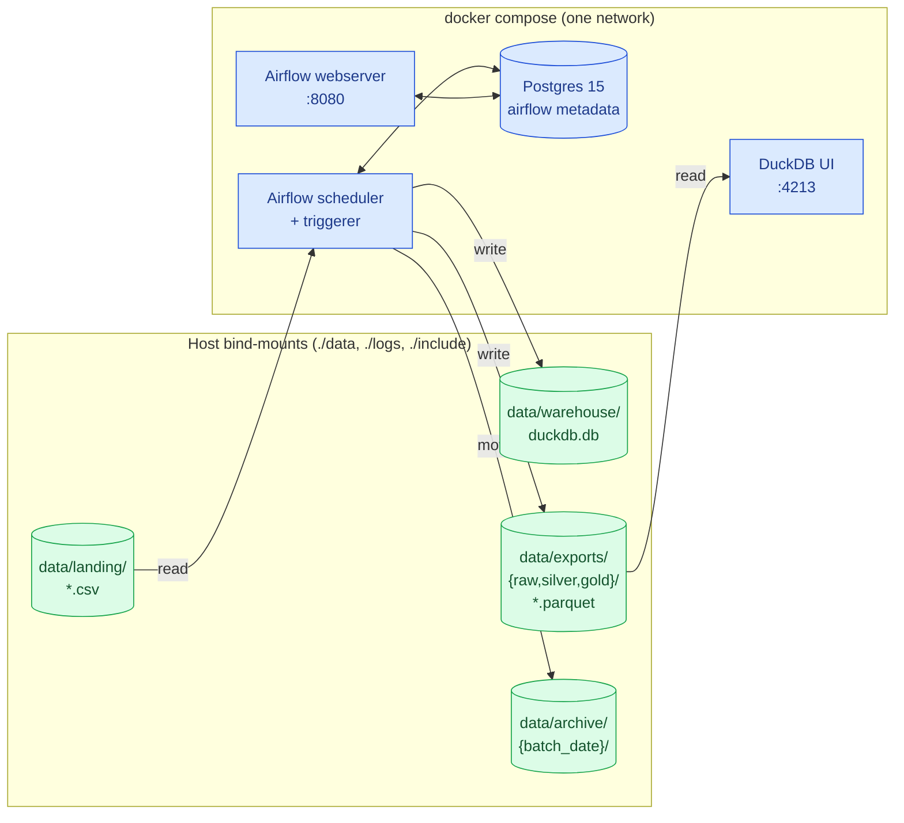
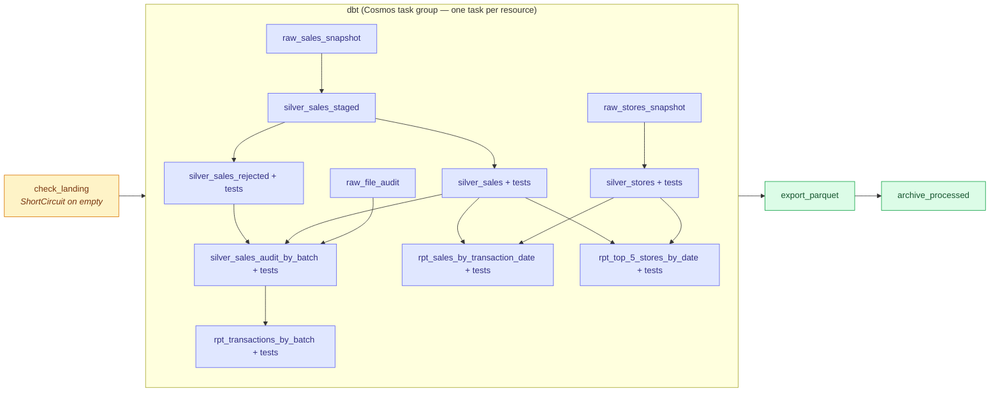
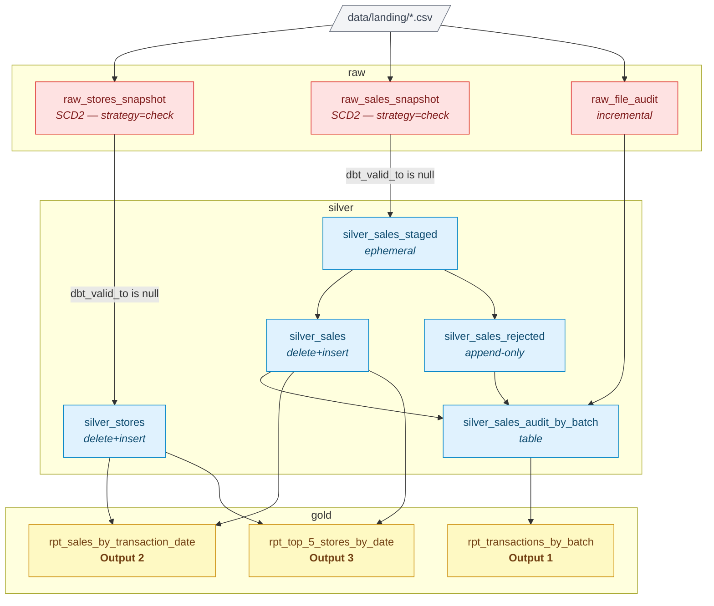

# R2 Capital — Sr. Data Engineer Assessment

A daily ELT pipeline that ingests synthetic store and sales CSVs through four
layers — **Landing → Raw (SCD Type 2) → Silver (incremental upsert) → Gold
(3 reports)** — orchestrated by **Airflow + Astronomer Cosmos** against a
**DuckDB** warehouse. Validated rows are exported to Parquet and made
queryable through DuckDB's built-in web UI.

> [!TIP]
> Companion docs: [System design](docs/design.md) · [Logical data model (DDL)](docs/ddl.sql) · [Open questions for product](docs/questions.md)

---

## Contents

1. [Architecture](#architecture)
2. [Tech stack](#tech-stack)
3. [Services that stay up](#services-that-stay-up)
4. [Quick start](#quick-start)
5. [The DAGs](#the-dags)
6. [dbt model lineage](#dbt-model-lineage)
7. [Configuration](#configuration)
8. [Project layout](#project-layout)
9. [Logging](#logging)
10. [Tests](#tests)
11. [Idempotency](#idempotency)
12. [Caveats](#caveats)

---

## Architecture



DuckDB is intentionally a single embedded file. The DAG has the only
read-write connection on `duckdb.db`; the UI reads the **Parquet exports**
instead, so a long-lived UI session can never block a DAG run (DuckDB's
write lock is process-exclusive — see [Caveats](#caveats)).

---

## Tech stack

| Component | Version | Role |
|---|---|---|
| Apache Airflow | `2.10.4` | Orchestration |
| `astronomer-cosmos[dbt-duckdb]` | `1.9.0` | Generates one Airflow task per dbt resource |
| `dbt-core` / `dbt-duckdb` | `1.9.4` / `1.9.4` | Transformations |
| DuckDB | `1.2.2` | Warehouse + built-in web UI |
| `dbt-utils` / `dbt_expectations` | `1.3.0` / `0.10.8` | Helpers + data tests |
| Faker | `30.x` | Synthetic data generation |
| Postgres | `15` | Airflow metadata DB only |

---

## Services that stay up

`docker compose up -d` brings up four long-lived containers (plus the
one-shot `airflow-init`). You trigger the DAG whenever you want — there is
no need to keep restarting anything.

| Service     | Port | What it does |
|-------------|------|--------------|
| `webserver` | 8080 | Airflow UI — trigger and monitor DAGs |
| `scheduler` | —    | Schedules `@daily` and runs on-demand triggers |
| `duckdb-ui` | 4213 | DuckDB web UI; views `raw` + `silver` + `gold` from Parquet exports, refreshed every 30 s |
| `postgres`  | —    | Airflow metadata DB (internal only) |

---

## Quick start

> [!NOTE]
> Requires Docker + Docker Compose v2. The first `up --build` takes a few
> minutes; the `airflow-init` container migrates the metadata DB and runs
> `dbt deps` once, then exits.

<details>
<summary><b>1 · Bootstrap</b></summary>

```bash
cp .env.example .env
docker compose up -d --build
```

Watch the init container finish:

```bash
docker compose logs -f airflow-init
```

</details>

<details>
<summary><b>2 · Generate sample data</b></summary>

UI: <http://localhost:8080> (login `admin` / `admin`) → `generate_data` →
**Trigger DAG**. Edit the JSON configuration in the trigger form, or leave it
as-is for the defaults.

CLI:

```bash
docker compose exec scheduler airflow dags trigger generate_data \
  --conf '{"num_stores":50,"num_sales_files":3,"rows_per_sales_file":1000,"batch_date":"20260430","invalid_rate":0.05}'
```

| Config key | Default | Notes |
|---|---|---|
| `landing_path` | `LANDING_PATH` env | Output folder for generated CSV files |
| `num_stores` | 50 | Total store rows in `stores_<batch>.csv` |
| `num_sales_files` | 2 | Number of `sales_<batch>_NNN.csv` files |
| `rows_per_sales_file` | 500 | Rows per sales file |
| `batch_date` | today (UTC) | `YYYYMMDD` embedded in filenames; omit or pass `null` for today |
| `invalid_rate` | 0.05 | Fraction of rows deliberately malformed |
| `duplicate_rate` | 0.02 | Fraction of duplicated sales rows |
| `days_window` | 7 | Number of days over which sales timestamps are spread |
| `include_headers` | `auto` | `auto`/`always`/`never` (matches spec "may or may not") |
| `seed` | `null` | Deterministic generation |

</details>

<details>
<summary><b>3 · Trigger the pipeline DAG</b></summary>

UI: <http://localhost:8080> (login `admin` / `admin`) → `r2_pipeline` →
**Trigger DAG**.

CLI:

```bash
docker compose exec scheduler airflow dags trigger r2_pipeline
```

</details>

<details>
<summary><b>4 · Inspect the results</b></summary>

**DuckDB web UI** — <http://localhost:4213>. Once the first run completes,
the `raw`, `silver`, and `gold` schemas are queryable through views over
the Parquet exports.

**From the host with any DuckDB CLI ≥ 1.2** (the file is a bind-mount):

```bash
duckdb data/warehouse/duckdb.db -c \
  "SELECT * FROM gold.rpt_transactions_by_batch ORDER BY batch_date DESC"
```

**From inside the scheduler container**:

```bash
docker compose exec scheduler python -c "
import duckdb, os
con = duckdb.connect(os.environ['DUCKDB_PATH'], read_only=True)
print(con.sql('SELECT * FROM gold.rpt_top_5_stores_by_date ORDER BY transaction_date DESC, top_rank_id').fetchdf().to_string(index=False))
"
```

</details>

<details>
<summary><b>5 · Run tests on demand</b></summary>

```bash
docker compose exec scheduler bash -c \
  'cd $DBT_PROJECT_DIR && /home/airflow/.local/bin/dbt test --profiles-dir $DBT_PROFILES_DIR'
```

</details>

<details>
<summary><b>6 · Idempotency check</b></summary>

Re-stage the same files (copy from `data/archive/{batch}/` back to
`data/landing/`) and trigger the DAG again — gold rows are **identical**.
Snapshots produce no new versions, silver upserts collapse duplicates, and
exports overwrite atomically.

</details>

---

## The DAGs

`generate_data` is a manual-only helper DAG that writes configurable Faker
CSV files into landing. `r2_pipeline` is the ELT DAG that reads landing,
runs dbt, exports Parquet, and archives processed CSVs.



> [!IMPORTANT]
> Cosmos parses the dbt manifest at DAG load and emits one Airflow task per
> resource (`<model>.run` and `<model>.test`). The actual rendered task
> count is **22**: `check_landing` + 19 dbt tasks + `export_parquet` +
> `archive_processed`.

---

## dbt model lineage



The silver layer always reads **only the current versions** of each
snapshot row (`dbt_valid_to is null`); validation predicates split the
parsed result into `silver_sales` (clean) and `silver_sales_rejected`
(audit). See [docs/design.md](docs/design.md) for the full reasoning.

---

## Configuration

All settings flow from `.env`. Container paths must match the bind-mounts
in `docker-compose.yml`.

| Variable | Default | Purpose |
|---|---|---|
| `LANDING_PATH` | `/opt/airflow/data/landing` | Where partner / Faker drops new CSVs |
| `ARCHIVE_PATH` | `/opt/airflow/data/archive` | Where processed CSVs are moved |
| `DUCKDB_PATH` | `/opt/airflow/data/warehouse/duckdb.db` | Warehouse file |
| `EXPORT_PATH` | `/opt/airflow/data/exports` | Parquet exports root (mounted as `./data/exports/`) |
| `LOG_PATH` | `/opt/airflow/logs` | Root for `scripts/`, `dbt/`, `airflow/` logs |
| `DBT_PROJECT_DIR` | `/opt/airflow/include/dbt` | dbt project root |
| `DBT_PROFILES_DIR` | `/opt/airflow/include/dbt` | `profiles.yml` location |
| `DUCKDB_UI_PORT` | `4213` | Host port for DuckDB web UI |
| `_AIRFLOW_WWW_USER_USERNAME` / `_PASSWORD` | `admin` / `admin` | Airflow web login |

`include/dbt/dbt_project.yml` mirrors the path env vars under `vars:` so
every model reads from the same source of truth.

---

## Project layout

```
.
├── README.md                        # This file
├── docs/
│   ├── design.md                    # Architecture + design decisions
│   ├── ddl.sql                      # Logical data model DDL
│   └── questions.md                 # Open questions for product
├── Dockerfile                       # apache/airflow:2.10.4-py3.11 + pip deps
├── docker-compose.yml               # 4 services + airflow-init
├── requirements.txt
├── .env.example, .gitignore, .dockerignore
├── dags/
│   ├── generate_data.py             # Manual Faker data-generation DAG
│   └── r2_pipeline.py               # Pipeline DAG (Cosmos + Python tasks)
├── include/
│   ├── dbt/
│   │   ├── dbt_project.yml, profiles.yml, packages.yml
│   │   ├── snapshots/               # SCD Type 2 — raw_stores/raw_sales
│   │   ├── models/
│   │   │   ├── _sources.yml
│   │   │   ├── raw/raw_file_audit.sql
│   │   │   ├── silver/              # 5 models + _silver.yml tests
│   │   │   └── gold/                # 3 reports + _gold.yml tests
│   │   └── macros/
│   │       ├── generate_schema_name.sql   # use literal raw/silver/gold schemas
│   │       └── read_landing.sql           # graceful empty-landing handling
│   └── scripts/
│       ├── logger.py                # stdout + rotating file logger
│       ├── generate_data.py         # Faker-based generator
│       ├── clear_landing.py
│       ├── archive_files.py
│       ├── export_parquet.py        # raw + silver + gold → Parquet
│       └── duckdb_ui.py             # long-running UI service + TCP relay
├── data/                            # gitignored content; folders kept
│   ├── landing/, archive/, warehouse/
│   └── exports/{raw,silver,gold}/   # .parquet artifacts (gitignored)
└── logs/                            # gitignored
    ├── airflow/, dbt/, scripts/
```

---

## Logging

- **Python scripts** — `include/scripts/logger.py` writes to stdout **and**
  a rotating file under `LOG_PATH/scripts/{name}.log` (10 MB × 5).
- **dbt** — `DBT_LOG_PATH=/opt/airflow/logs/dbt` is set in
  `docker-compose.yml`; Cosmos `append_env=True` propagates it.
- **Airflow** — native task and scheduler logs land in `logs/airflow/` via
  the bind-mount.

---

## Tests

`dbt_expectations` covers every silver and gold model. The Cosmos task
group runs each model's tests immediately after the model itself.

| Layer | Coverage |
|---|---|
| **Silver** | UUID + hex regex on keys, length bounds (`receipt_token`, `store_name`), not-null + unique on natural keys, compound uniqueness on `(store_token, transaction_id)`, `amount >= 0`, `rejection_reason` ∈ known set |
| **Gold** | row-count caps (40/40/50), `top_rank_id ∈ {1..5}`, not-null + unique on report keys, regex on UUIDs surfaced in reports |

Run all tests on demand:

```bash
docker compose exec scheduler bash -c \
  'cd $DBT_PROJECT_DIR && /home/airflow/.local/bin/dbt test --profiles-dir $DBT_PROFILES_DIR'
```

---

## Idempotency

Every component is designed to be safely re-runnable.

| Mechanism | Where | Effect |
|---|---|---|
| Snapshot `strategy='check'` | `raw_*_snapshot` | Unchanged input → 0 new rows |
| `incremental_strategy='delete+insert'` | `silver_stores`, `silver_sales` | Upsert on natural key; duplicates collapse to latest |
| File-level filter | `raw_file_audit` | Already-recorded files are skipped |
| Atomic Parquet write | `export_parquet.py` | `.tmp` + `os.replace`; readers never see a half-written file |
| Archive-on-success | `archive_processed` | Failures leave files in landing for safe retry |
| ShortCircuit on empty landing | `check_landing` | Downstream tasks are SKIPPED, not failed |

The full failure/replay matrix is in
[docs/design.md → Idempotency contract](docs/design.md#idempotency-contract).

---

## Caveats

> [!WARNING]
> **DuckDB single-writer lock.** Only one process can hold a read-write
> connection on a `.db` file. The DAG holds it briefly during dbt runs;
> the UI service therefore reads the **Parquet exports** rather than the
> live warehouse to stay always-available.

> [!NOTE]
> **dbt 1.9 + Python 3.12 multiprocessing on macOS.** Local `dbt build`
> with `--threads > 1` can SIGSEGV on macOS hosts (a known dbt issue).
> Inside the container (Linux + Python 3.11) it's fine; for ad-hoc local
> runs use `--threads 1`.

> [!TIP]
> **Reprocess a batch.** Move files from `data/archive/{batch_date}/`
> back to `data/landing/` and trigger the DAG. Snapshot + upsert
> semantics make this safe.
