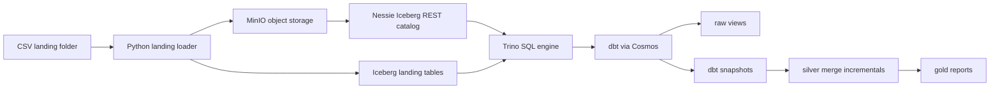

# R2 Capital Lakehouse Pipeline

Local ELT pipeline for the R2 Capital challenge, now backed by an open-source Iceberg lakehouse:

- Airflow and Cosmos orchestrate the run.
- A small Python landing loader validates CSV hashes, preserves physical CSV row numbers, uploads accepted files to MinIO, and writes raw Iceberg landing tables through Trino.
- dbt owns the transformation graph: sources, raw views, native snapshots, Trino merge incrementals, tests, docs, and gold reporting tables.
- Trino is the SQL engine, Nessie is the Iceberg REST catalog, and MinIO stores Parquet data and Iceberg metadata locally.

MinIO is not conceptually required. The same design can later point at AWS S3 or Cloudflare R2 through environment variables after compatibility testing. For this local stack, MinIO is the right default because the Nessie and Trino Iceberg REST path is S3-oriented and easy to validate without cloud credentials.

## Native dbt Boundary

Native dbt is possible for the core modeling features this repo needs:

| Feature | Status |
| --- | --- |
| Sources | Used for loader-owned Iceberg landing tables |
| Table and view models | Used across raw, silver, and gold |
| Snapshots | Used for store and sales current-state history |
| Incremental merge | Used for current silver stores, current silver sales, and rejected sales |
| Tests and docs | Used through dbt generic tests, dbt-expectations, and custom singular tests |

dbt does not replace dynamic CSV ingestion here. File discovery, immutable hash validation, conflict quarantine, MinIO upload, and raw landing-table inserts remain in `include/scripts/landing_manifest.py`. That loader is intentionally small and lakehouse-neutral.

## Architecture



The raw landing tables are append-style audit surfaces owned by the loader. dbt snapshots track current-state changes between snapshot runs; they are not intended to be a full event-history engine for every same-key change that arrives inside one run. The raw received tables retain those events for audit.

## Services

| Service | Image | Purpose |
| --- | --- | --- |
| `webserver` / `scheduler` / `airflow-init` | `apache/airflow:2.10.4-python3.11` plus `requirements.txt` | Airflow, Cosmos, dbt, landing loader |
| `trino` | `trinodb/trino:480` | SQL engine and dbt adapter target |
| `query-ui` | Local Vite build served by Nginx | Browser query editor for Trino |
| `nessie` | `ghcr.io/projectnessie/nessie:0.107.5` | Iceberg REST catalog |
| `minio` | `minio/minio:RELEASE.2025-09-07T16-13-09Z` | Local S3-compatible object store |
| `minio-init` | `minio/mc:RELEASE.2025-08-13T08-35-41Z` | Creates the local bucket |
| `postgres` | `postgres:15.8` | Airflow metadata database |

Local ports:

| URL | Service |
| --- | --- |
| `http://localhost:8080` | Airflow UI |
| `http://localhost:8081` | Trino coordinator |
| `http://localhost:3000` | Trino Query UI |
| `http://localhost:9011` | MinIO console |
| `http://localhost:19120` | Nessie API |

Default MinIO credentials are `minioadmin` / `minioadmin`. Default Airflow credentials are `admin` / `admin`.

## Run Locally

```bash
cp .env.example .env
docker compose up -d --build
docker compose ps
```

Open `http://localhost:3000` to query Trino from the browser. Useful starter queries:

```sql
SHOW SCHEMAS FROM lakehouse;
SHOW TABLES FROM lakehouse.gold;
SELECT * FROM lakehouse.gold.rpt_sales_by_transaction_date LIMIT 100;
```

Generate sample files:

```bash
docker compose exec scheduler python /opt/airflow/dags/generate_data.py
```

Trigger the DAG from the Airflow UI or run the main steps directly:

```bash
docker compose exec scheduler python -m include.scripts.landing_manifest \
  --landing-path /opt/airflow/data/landing \
  --archive-path /opt/airflow/data/archive \
  --quarantine-path /opt/airflow/data/quarantine

docker compose exec scheduler bash -lc 'cd /opt/airflow/include/dbt && dbt build --profiles-dir /opt/airflow/include/dbt'
```

Useful dbt checks:

```bash
docker compose exec scheduler bash -lc 'cd /opt/airflow/include/dbt && dbt debug --profiles-dir /opt/airflow/include/dbt'
docker compose exec scheduler bash -lc 'cd /opt/airflow/include/dbt && dbt deps --profiles-dir /opt/airflow/include/dbt'
docker compose exec scheduler bash -lc 'cd /opt/airflow/include/dbt && dbt snapshot --profiles-dir /opt/airflow/include/dbt'
docker compose exec scheduler bash -lc 'cd /opt/airflow/include/dbt && dbt build --profiles-dir /opt/airflow/include/dbt'
```

## Data Flow

1. `check_landing` short-circuits when no CSV files are present.
2. `validate_landing` reads `data/landing/*.csv`, calculates SHA-256 hashes, rejects changed replays by filename, uploads accepted files to MinIO, and writes Iceberg landing tables:
   - `raw.landing_file_manifest`
   - `raw.landing_file_rejections`
   - `raw.landing_stores_received`
   - `raw.landing_sales_received`
3. dbt builds raw views over those landing tables.
4. dbt snapshots create `snapshots.raw_stores_snapshot` and `snapshots.raw_sales_snapshot`.
5. Silver models use Trino `merge` incrementals:
   - `silver_stores` uses `store_token`.
   - `silver_sales` uses stable `transaction_uid`.
   - `silver_sales_rejected` uses `row_uid`.
6. Gold models publish the three challenge reports.
7. `archive_processed` moves successfully processed files into `data/archive/{batch_date}/`.

## dbt Layout

| Path | Role |
| --- | --- |
| `include/dbt/models/_sources.yml` | Sources for loader-owned Iceberg landing tables |
| `include/dbt/models/raw` | Raw audit and current-state views |
| `include/dbt/snapshots` | Native dbt snapshots for stores and sales |
| `include/dbt/models/silver` | Validated current-state merge incrementals and rejection audit |
| `include/dbt/models/gold` | Challenge reports |
| `include/dbt/tests` | Singular balance tests |
| `include/dbt/macros/data_tests.sql` | Trino regex generic test |

## Key Design Choices

| Choice | Reason |
| --- | --- |
| Iceberg REST catalog through Nessie | Keeps the catalog open-source and works well with Trino and dbt-trino |
| MinIO for local object storage | Gives a reproducible S3-compatible warehouse without cloud credentials |
| Loader-owned landing tables | dbt is not a file watcher or dynamic CSV ingestion service |
| dbt snapshots for SCD2 | Removes manual SCD2 merge hooks and uses dbt-native history |
| Trino merge incrementals | Keeps current silver tables idempotent on business keys |
| Raw received tables separate from snapshots | Preserves full row-level audit even when snapshots only track current-state changes per run |

## Environment

| Variable | Default | Purpose |
| --- | --- | --- |
| `TRINO_HOST` | `trino` | Trino host inside Compose |
| `TRINO_PORT` | `8080` | Trino container port |
| `TRINO_HOST_PORT` | `8081` | Trino host port |
| `TRINO_QUERY_UI_PORT` | `3000` | Browser port for the Trino Query UI |
| `TRINO_USER` | `dbt` | Trino user for dbt and loader |
| `TRINO_CATALOG` | `lakehouse` | Trino Iceberg catalog |
| `TRINO_SCHEMA` | `raw` | Default schema |
| `MINIO_ENDPOINT` | `http://minio:9000` | S3 endpoint used inside Compose |
| `MINIO_API_PORT` | `9010` | MinIO host API port |
| `MINIO_CONSOLE_PORT` | `9011` | MinIO host console port |
| `MINIO_BUCKET` | `r2-lakehouse` | Iceberg warehouse and landing object bucket |
| `MINIO_ROOT_USER` | `minioadmin` | Local MinIO access key |
| `MINIO_ROOT_PASSWORD` | `minioadmin` | Local MinIO secret key |
| `AWS_REGION` | `us-east-1` | S3 region value for MinIO and Nessie |

## Verification

Recommended migration checks:

```bash
python3 -m unittest include.tests.test_landing_manifest
python3 -m compileall dags include/scripts include/tests
docker compose config
docker compose up -d --build
docker compose ps
docker compose exec scheduler bash -lc 'cd /opt/airflow/include/dbt && dbt debug --profiles-dir /opt/airflow/include/dbt'
docker compose exec scheduler bash -lc 'cd /opt/airflow/include/dbt && dbt build --profiles-dir /opt/airflow/include/dbt'
rg "data[b]end|DATA[B]END|landing_[s]tage|export_[s]tage" README.md docs docker-compose.yml .env.example include dags requirements.txt trino
```

Replay the same accepted files to confirm idempotency: silver current tables should not duplicate rows, audit counts should remain balanced, and snapshots should not add new rows when attributes do not change.
