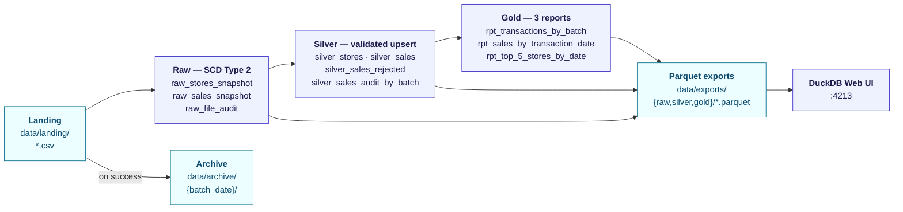
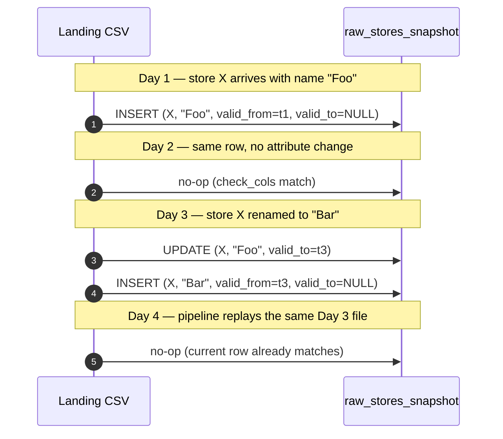
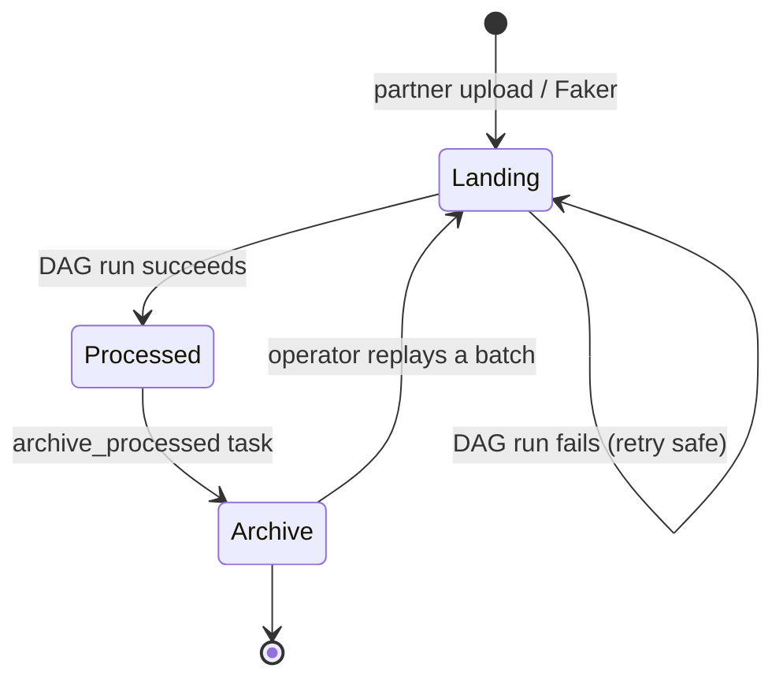
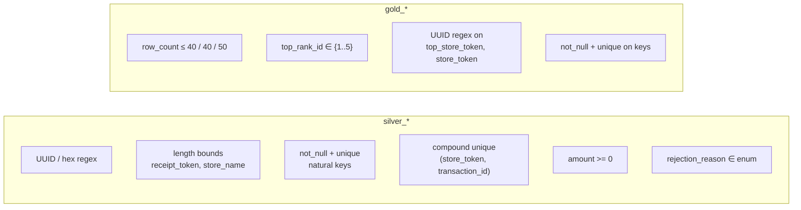

# System Design

## Goals

Process daily store + sales CSVs from a partner-managed bucket (modeled
here as a local `data/landing/` folder), persist a queryable history, and
produce three operational reports per day. Optimize for:

| Goal | How we achieve it |
|---|---|
| **Idempotency** | Snapshot `check` strategy, delete+insert upsert in silver, file-level audit, atomic exports, archive-on-success |
| **Fault tolerance** | Files stay in landing until the *full* transformation succeeds; partial failures are recoverable on the next trigger |
| **Configurability** | Paths, generator knobs, and tests are env vars or `dbt_project.yml` settings, never hard-coded |
| **Auditability** | Invalid records are kept (not silently dropped), file ingestion is logged, SCD Type 2 preserves attribute history |

---

## High-level flow



---

## Stage by stage

### Landing — `data/landing/`

The inbox. Filenames follow the spec: `stores_YYYYMMDD.csv` and
`sales_YYYYMMDD[_NNN].csv`. Header rows may or may not be present; both
are tolerated downstream by reading with explicit column types and
filtering literal header rows by value comparison.

`include/scripts/generate_data.py` replays the partner contract via Faker:

- valid stores + sales rows per format spec,
- ~5 % deliberately malformed rows (bad UUID, negative amount, unparseable
  timestamp …) — controlled by `--invalid-rate`, exercises the silver
  validator,
- ~2 % intra-file duplicate sales rows (`--duplicate-rate`) — exercises
  the snapshot dedup + silver upsert,
- header presence randomized when `--include-headers=auto`.

### Raw — dbt snapshots (SCD Type 2)

dbt's native `snapshot` materialization with `strategy='check'`. The
strategy compares `check_cols` between the inbound row and the existing
*current* row keyed by `unique_key`; when they differ, the prior row is
expired (`dbt_valid_to = now()`) and a new row is inserted.



**Why snapshots over a hand-written SCD2:**

- it is the dbt-native pattern (less code to read and review);
- the operator is **idempotent by construction** — re-running on
  unchanged input produces zero new rows;
- DuckDB executes the merge cheaply because tables are file-resident and
  unique-key lookups are fast.

Within a single run we dedupe the snapshot input with
`qualify row_number() over …` so the strategy never sees two rows with
the same key (which it would otherwise reject). Sales use the surrogate
key `store_token || '|' || transaction_id` because snapshot config takes
a single `unique_key` column.

`raw_file_audit` (incremental) records one row per ingested file with
`row_count`, `batch_date`, and `processed_at`. It powers Output 1's
"total processed raw transactions" without needing a per-row received
table.

### Silver — incremental upsert + validation

`silver_stores` and `silver_sales` are `incremental` models with
`incremental_strategy='delete+insert'` keyed on the natural key (composite
for sales). Each run re-derives the latest version per key from the
snapshot's *current* rows (`dbt_valid_to is null`) and upserts.

Validation is centralized in `silver_sales_staged` — an **ephemeral**
model that defensively parses each field (`try_strptime`, `try_cast`,
regex checks) and emits a non-null `rejection_reason` for invalid rows.
Two downstream models filter that one staged result:

- `silver_sales` keeps `rejection_reason IS NULL` (and is upserted),
- `silver_sales_rejected` keeps `rejection_reason IS NOT NULL`
  (append-only audit table).

`silver_sales_audit_by_batch` joins `raw_file_audit`, `silver_sales`, and
`silver_sales_rejected` to produce one row per `batch_date` with the
totals that Output 1 needs:

```
total_raw_transactions = Σ row_count from raw_file_audit (sales files)
valid_transactions     = COUNT(*) from silver_sales         per batch
invalid_transactions   = COUNT(*) from silver_sales_rejected per batch
processing_date        = MAX(processed_at) from raw_file_audit per batch
```

### Gold — three reports

Each is a `table` materialization (rebuilt every run; small, no
incremental complexity). All three filter to the latest N
`transaction_date` / `batch_date` values via `qualify row_number()`.

| Output | Source | Top-level transformation |
|---|---|---|
| **1** — `rpt_transactions_by_batch` | `silver_sales_audit_by_batch` | Stamp `current_date`, order by `batch_date DESC`, limit 40 |
| **2** — `rpt_sales_by_transaction_date` | `silver_sales` ⨝ `silver_stores` | Aggregate per `transaction_date`; monthly running total via window; pick top store via `row_number()` |
| **3** — `rpt_top_5_stores_by_date` | `silver_sales` ⨝ `silver_stores` | Rank per date (`row_number()`), filter `≤ 5`, restrict to last 10 dates with sales |

### Parquet export + always-on UI

After dbt finishes, the `export_parquet` task copies the SCD2 raw
snapshots, every silver table, and the three gold reports to
`data/exports/{schema}/{table}.parquet`. Files are written to a `.tmp`
sibling and atomically renamed so a half-finished export can never be
observed by the UI service.

A long-lived `duckdb-ui` container hosts DuckDB's built-in web UI on
`:4213`. It runs an in-memory database whose `raw`, `silver`, and `gold`
schemas are populated by `CREATE OR REPLACE VIEW … FROM read_parquet(...)`
over `EXPORT_PATH`. The view set is refreshed every 30 seconds, so new
tables and updated snapshots appear without restarting the service.

> [!NOTE]
> The split — UI on Parquet, DAG on the warehouse `.db` — is forced by
> DuckDB's single-writer locking. A long-lived UI connection on the live
> warehouse would prevent the DAG from acquiring its write lock during
> dbt runs (and a long-lived RW lock from the DAG would block the UI).
> Reading through Parquet decouples the two and gives the UI permanent
> availability.

A small Python TCP relay inside `duckdb_ui.py` forwards
`0.0.0.0:4213 → 127.0.0.1:4213` because DuckDB's UI server only binds
to localhost; without the relay, the published Docker port would not
deliver traffic to the UI process.

---

## File lifecycle



---

## Idempotency contract

| Failure mode | Behavior |
|---|---|
| Pipeline crashes mid-run | Files remain in `landing/`. Next trigger replays. Snapshots + upserts handle re-arrival cleanly. |
| Same files re-uploaded | `raw_file_audit` skips them at the file level. Snapshot `check` produces no diff. |
| File received twice with different content for the same key | Snapshot expires the prior version, inserts the new one. Silver upsert reflects the new attributes. |
| Duplicate transaction inside a single file | Snapshot dedupes via `qualify row_number()`, keeping the latest by `ingested_at`. |
| Empty landing on schedule trigger | `check_landing` short-circuits the DAG; downstream tasks are marked SKIPPED, not failed. |
| `export_parquet` partial write | Files are written to `.tmp` then renamed. The UI never reads a half-written Parquet. |

---

## Tests (`dbt_expectations`)



Tests run as Cosmos-generated downstream tasks of each model, so a
failure surfaces in Airflow's UI per-model.

---

## Trade-offs / what is intentionally out of scope

- **No external bucket integration.** Landing is a local folder per the
  spec; the same dbt models would work against `s3://` paths via DuckDB
  `httpfs`, but rigging that up is deferred.
- **No partial-batch replay.** Reprocessing a single sales file inside a
  batch requires moving it back from `archive/`. This is fine because
  archives are organized by `batch_date`, but a CLI helper would be a
  nice add.
- **No PII handling.** The synthetic `store_name` is the only "free
  text" field; in production we would mask or tokenize it.
- **No external source for landing.** We considered registering CSVs as
  dbt sources via dbt-duckdb's `external_location`, but the file-glob
  pattern works better with `raw_file_audit`'s per-file row-count
  requirement and avoids relying on dbt-duckdb-specific source metadata.
- **Parquet exports are overwriting, not partitioned.** The UI shows the
  *latest* state. History lives in the snapshot tables and the
  audit-by-batch table.
