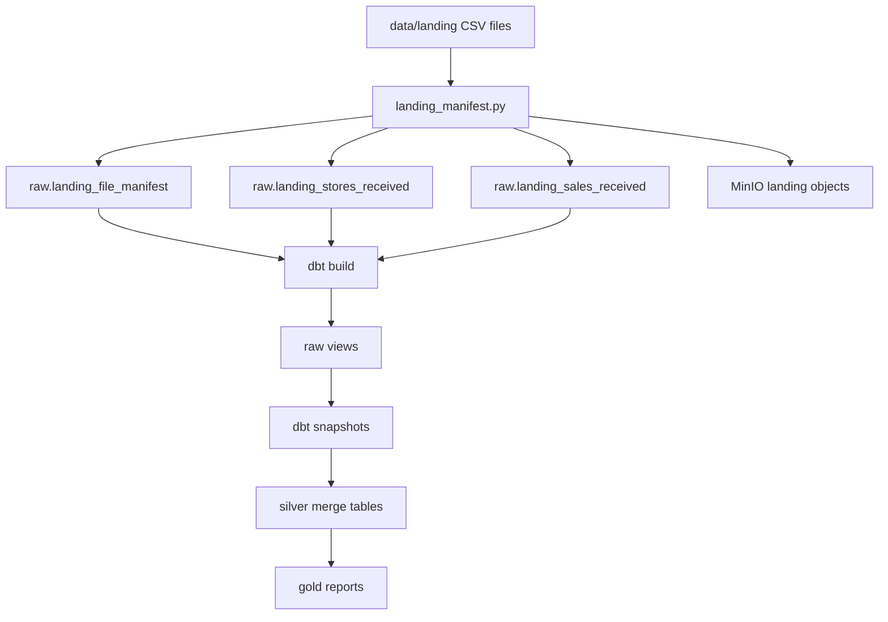

# Lakehouse Design

## Goal

Use an open-source local lakehouse stack while moving as much transformation behavior as possible back to native dbt features.

## Runtime

| Layer | Component |
| --- | --- |
| Orchestration | Airflow and Astronomer Cosmos |
| SQL engine | Trino |
| Catalog | Nessie Iceberg REST catalog |
| Storage | MinIO S3-compatible object storage |
| Table format | Apache Iceberg with Parquet files |
| Modeling | dbt-trino |

## Flow

## dbt Feature Use

| dbt feature | Implementation |
| --- | --- |
| Sources | Landing Iceberg tables managed by the loader |
| Snapshots | `raw_stores_snapshot` and `raw_sales_snapshot` |
| Incremental merge | `silver_stores`, `silver_sales`, `silver_sales_rejected` |
| Tests | Generic tests, dbt-expectations, and singular balance tests |
| Docs | Standard dbt docs generation |

The remaining custom loader is outside dbt because dbt does not handle dynamic file discovery, immutable filename hash checks, quarantine handling, or object upload.

## Idempotency

| Surface | Rule |
| --- | --- |
| Files | Same filename and same SHA-256 can replay; same filename and different SHA-256 is quarantined |
| Received rows | `row_uid` is based on source file, physical CSV row number, and file hash |
| Current stores | Merge key is `store_token` |
| Current sales | Merge key is stable `transaction_uid` from `store_token` and `transaction_id` |
| Snapshots | dbt check strategy closes prior rows when tracked attributes change |

## Snapshot Boundary

The received raw tables are the full audit/event history. dbt snapshots track current-state changes between snapshot runs. If multiple accepted files for the same key arrive before one snapshot run, the snapshot captures the latest current state for that run, while the raw received table still retains each physical CSV row.

## MinIO Requirement

MinIO is required for this local Compose version, not for the architecture in general. The catalog and loader are S3-compatible, so the object store can be swapped later with AWS S3 or Cloudflare R2 by changing endpoint, bucket, region, and credentials after compatibility testing.
